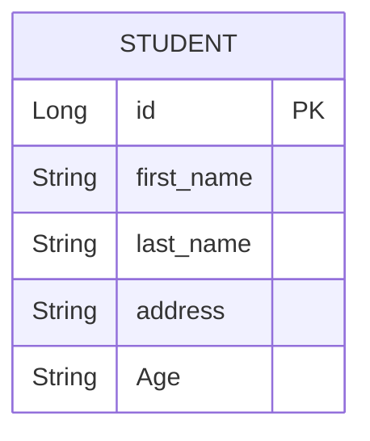

# Student RESTful API (Hexagonal Architecture) 

[](https://www.oracle.com/java/)
[](https://spring.io/projects/spring-boot)
[](https://www.postgresql.org/)


[](https://alistair.cockburn.us/hexagonal-architecture/)

RESTful API backend for student management developed with Spring Boot and Hexagonal Architecture. It implements CRUD operations with a focus on maintainability, scalability, clean code, and best practices.

## 🌟 Main Features
- **Hexagonal Architecture** with clear separation of responsibilities
- **DTOs** for requests and responses
- **Centralized error handling** with custom exceptions, controller advisor, error catalog and use of a specific model for error normalization
- **Endpoint-independent versioning** via HTTP method
- **Automated mapping** between entities and DTOs
- **Robust validation** of input data

## 🧩 Project Structure

```
src/
├── main/
│   ├── java/
│   │   └── com/
│   │       └── backend.student.app/
│   │           ├── application/                                        ➤ Application (Use Cases and Ports)
│   │           │   ├── ports/
│   │           │   │   ├── input                                       ➤ Input Ports (Service Port)
│   │           │   │   └── output                                      ➤ Output Ports (Persistence Port)
│   │           │   └── usecase/                                        ➤ Interactors (Use Cases)
│   │           ├── domain/                                             ➤ Core - Domain
│   │           │   ├── model/                                          ➤ Models
│   │           │   └── exception/                                      ➤ Custom Exceptions
│   │           ├── infrastructure/                                     ➤ Infrastructure (Adapters)
│   │           │   └── adapters/
│   │           │       ├── input/                                      ➤ Input Adapters
│   │           │       │   └── rest/
│   │           │       │       ├── dto/                                ➤ Data Transfer Obejects
│   │           │       │       │   ├── request/
│   │           │       │       │   └── response/ 
│   │           │       │       ├── mapper/                             ➤ Mappers DTO <-> Model
│   │           │       │       ├── GlobalControllerAdviser.java        ➤ Error Handler
│   │           │       │       └── StudentRestController.java          ➤ REST Controller
│   │           │       └── output/                                     ➤ Output Adapters
│   │           │           └── database/
│   │           │               └── postgres/
│   │           │                   ├── entity/                         ➤ Database Entities
│   │           │                   ├── mapper/                         ➤ Mappers Entity <-> Model
│   │           │                   ├── repository/                     ➤ JPA - Hibernate
│   │           │                   └── StudentPersistenceAdapter/      ➤ Persistence Adapter
│   │           └── utils/
│   │           │   └── ErrorCatalog.java                               ➤ Error Catalog
│   │           └── StudentApplication.java                             ➤ Spring Boot Main Run File
│   └── resources/
│       └── application.yml                                             ➤ Configurations
└── test/                                                               ➤ Tests
docker-compose.yml                                                      ➤ Docker Compose File
```

## ⚙️ Technologies Used
- **Core**: Java 21, Spring Boot 3.5.3
- **Architecture**: Hexagonal (Ports & Adapters)
- **Persistence**: Spring Data JPA, Hibernate, PostgreSQL
- **Anotation**: Lombok
- **Mapping**: MapStruct
- **Validation**: Jakarta Validation
- **Dependency Management**: Maven
- **Container Platform**: Docker

## 🛠️ Setup and Installation
1. **Requirements**:
   - Java 21
   - PostgreSQL 14+
   - Maven 3.8+
   - Docker 4.42+

2. **Clone repository**:
   ```bash
   git clone https://github.com/alexdevzz/spring-hex-student-backend.git
   cd spring-hex-student-backend
   ```
   
3. **Configure database** (application.yml):
   ```yaml
   spring:
     datasource:
       url: jdbc:postgresql://localhost:5432/your-db
       username: your-user
       password: your-pass
       driver-class-name: org.postgresql.Driver
     jpa:
       hibernate:
         ddl-auto: update
   ```

4. **Run**:
   ```bash
   mvn spring-boot:run
   ```

## 🚀 Endpoints (v1)
| Method | Endpoint                | Description                  |
|--------|-------------------------|------------------------------|
| POST   | `students/v1/api/`      | Create new student           |
| GET    | `students/v1/api/{id}`  | Get student by ID            |
| GET    | `students/v1/api/`      | List all students            |
| PUT    | `students/v1/api/{id}`  | Update student               |
| DELETE | `students/v1/api/{id}`  | Delete student               |

## ✅ Good Practices Implemented

### 1. Error Handling
```java
@RestControllerAdvice
public class GlobalControllerAdviser {

    @ResponseStatus(HttpStatus.NOT_FOUND)
    @ExceptionHandler(StudentNotFoundException.class)            // com.backend.student.app.domain.exception.StudentNotFoundException
    public ErrorResponse handleStudentNotFoundException() {      // com.backend.student.app.domain.model.ErrorResponse
        return ErrorResponse.builder()
                .code(STUDENT_NOT_FOUND.getCode())               // com.backend.student.app.utils.ErrorCatalog.STUDENT_NOT_FOUND
                .message(STUDENT_NOT_FOUND.getMessage())         // com.backend.student.app.utils.ErrorCatalog.STUDENT_NOT_FOUND
                .timestamp(LocalDateTime.now())
                .build();
    }

   // More handlers ...
}
```

### 2. DTOs y Mappers
```java
@Builder @Getter @Setter
@AllArgsConstructor @NoArgsConstructor
public class StudentCreateRequest {
    @NotBlank(message = "Field firt_name cannot be empty or null")
    private String firstName;
    @NotBlank(message = "Field last_name cannot be empty or null")
    private String lastName;
    @NotBlank(message = "Field address cannot be empty or null")
    private String address;
    @NotNull(message = "Flied age cannot be null")
    private Integer Age;

}

@Mapper(componentModel = "spring")                  // using Mapstruct ...
public interface StudentRestMapper {
    @Mapping(target = "id", ignore = true)
    Student toStudent(StudentCreateRequest request);
    StudentResponse toStudentResponse(Student student);
    List<StudentResponse> toStudentResponseList(List<Student> studentList);
}
```

### 3. Hexagonal Architecture
```java
// Port
public interface StudentPersistencePort {
    Optional<Student> findById(Long id);
    List<Student> findAll();
    Student save(Student student);
    void deleteById(Long id);
}

// Adapter
@Component
@RequiredArgsConstructor
public class StudentPersistenceAdapter implements StudentPersistencePort {

    private final StudentJpaRepository studentJpaRepository;
    private final StudentPersistenceMapper studentPersistenceMapper;

    @Override
    public Optional<Student> findById(Long id) {
        return studentJpaRepository.findById(id)
                .map(studentPersistenceMapper::ToStudent);
    }

   // More methods implementations ....
}
```

### 4. API Versioning
```java
@RestController
@RequestMapping("/students")
@RequiredArgsConstructor
public class StudentRestController {

    private final StudentServicePort servicePort;
    private final StudentRestMapper restMapper;

   // ...

    @GetMapping("/v1/api/{id}")
    public StudentResponse findById(@PathVariable Long id) {
        return restMapper.toStudentResponse(servicePort.findStudentById(id));
    }

    @PostMapping("/v1/api")
    public ResponseEntity<StudentResponse> create(@Valid @RequestBody StudentCreateRequest request) {
        return ResponseEntity.status(HttpStatus.CREATED)
                .body(restMapper.toStudentResponse(servicePort.createStudent(restMapper.toStudent(request))));
    }

   // ...
}
```

## 📊 Database Model


## 📦 Deployment with Docker Compose
```bash
docker-compose up -d
```

Docker Compose Configuration:
```yaml
services:
  postgres:
    image: postgres:14.18-bookworm
    container_name: postgres_spring_student_backend_container
    environment:
      POSTGRES_USER: your-user
      POSTGRES_PASSWORD: your-pass
      POSTGRES_DB: your-db
    ports:
      - "5432:5432"
    volumes:
      - postgres_data:/var/lib/postgresql/data
    restart: unless-stopped

volumes:
  postgres_data:
```

## 🤝 Contributions
1. Fork the project
2. Create your feature branch (`git checkout -b feature/new-feature`)
3. Commit your changes (`git commit -am 'Add new feature'`)
4. Push to the bransh (`git push origin feature/new-feature`)
5. Open a Pull Request

## 📄 License
Distributed under the MIT License. See `LICENSE` for more information.
```
